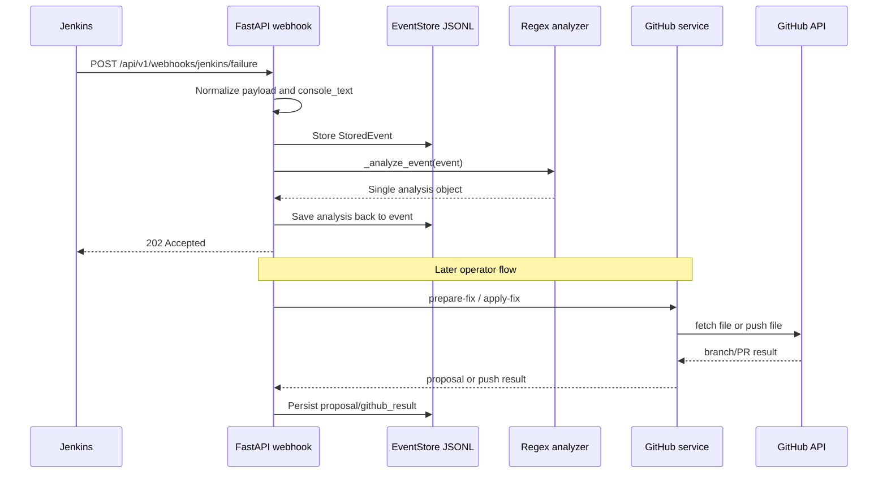
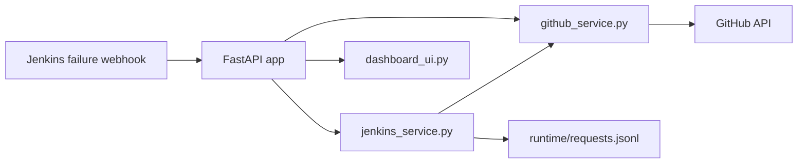
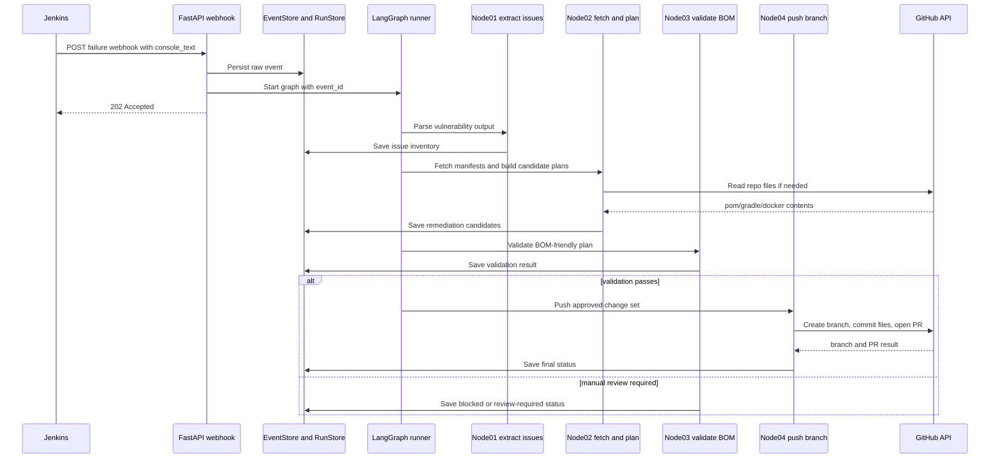
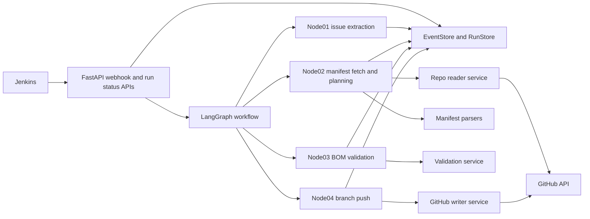

# Current And Target Flow

## Current system sequence

```mermaid
sequenceDiagram
    participant J as Jenkins
    participant A as FastAPI webhook
    participant E as EventStore JSONL
    participant R as Regex analyzer
    participant G as GitHub service
    participant GH as GitHub API

    J->>A: POST /api/v1/webhooks/jenkins/failure
    A->>A: Normalize payload and console_text
    A->>E: Store StoredEvent
    A->>R: _analyze_event(event)
    R-->>A: Single analysis object
    A->>E: Save analysis back to event
    A-->>J: 202 Accepted

    Note over A,G: Later operator flow
    A->>G: prepare-fix / apply-fix
    G->>GH: fetch file or push file
    GH-->>G: branch/PR result
    G-->>A: proposal or push result
    A->>E: Persist proposal/github_result
```

## Current component view

```mermaid
flowchart LR
    Jenkins[Jenkins failure webhook]
    App[FastAPI app]
    JS[jenkins_service.py]
    GS[github_service.py]
    UI[dashboard_ui.py]
    Store[runtime/requests.jsonl]
    GH[GitHub API]

    Jenkins --> App
    App --> JS
    App --> GS
    App --> UI
    JS --> Store
    JS --> GS
    GS --> GH
```

## Target system sequence

```mermaid
sequenceDiagram
    participant J as Jenkins
    participant A as FastAPI webhook
    participant E as EventStore and RunStore
    participant LG as LangGraph runner
    participant N1 as Node01 extract issues
    participant N2 as Node02 fetch and plan
    participant N3 as Node03 validate BOM
    participant N4 as Node04 push branch
    participant GH as GitHub API

    J->>A: POST failure webhook with console_text
    A->>E: Persist raw event
    A->>LG: Start graph with event_id
    A-->>J: 202 Accepted

    LG->>N1: Parse vulnerability output
    N1->>E: Save issue inventory
    LG->>N2: Fetch manifests and build candidate plans
    N2->>GH: Read repo files if needed
    GH-->>N2: pom/gradle/docker contents
    N2->>E: Save remediation candidates
    LG->>N3: Validate BOM-friendly plan
    N3->>E: Save validation result

    alt validation passes
        LG->>N4: Push approved change set
        N4->>GH: Create branch, commit files, open PR
        GH-->>N4: branch and PR result
        N4->>E: Save final status
    else manual review required
        N3->>E: Save blocked or review-required status
    end
```

## Target component view

```mermaid
flowchart LR
    Jenkins[Jenkins]
    API[FastAPI webhook and run status APIs]
    Store[EventStore and RunStore]
    Graph[LangGraph workflow]
    N1[Node01 issue extraction]
    N2[Node02 manifest fetch and planning]
    N3[Node03 BOM validation]
    N4[Node04 branch push]
    RepoReader[Repo reader service]
    Parsers[Manifest parsers]
    Validator[Validation service]
    Writer[GitHub writer service]
    GH[GitHub API]

    Jenkins --> API
    API --> Store
    API --> Graph
    Graph --> N1
    Graph --> N2
    Graph --> N3
    Graph --> N4
    N2 --> RepoReader
    N2 --> Parsers
    N3 --> Validator
    N4 --> Writer
    RepoReader --> GH
    Writer --> GH
    N1 --> Store
    N2 --> Store
    N3 --> Store
    N4 --> Store
```
