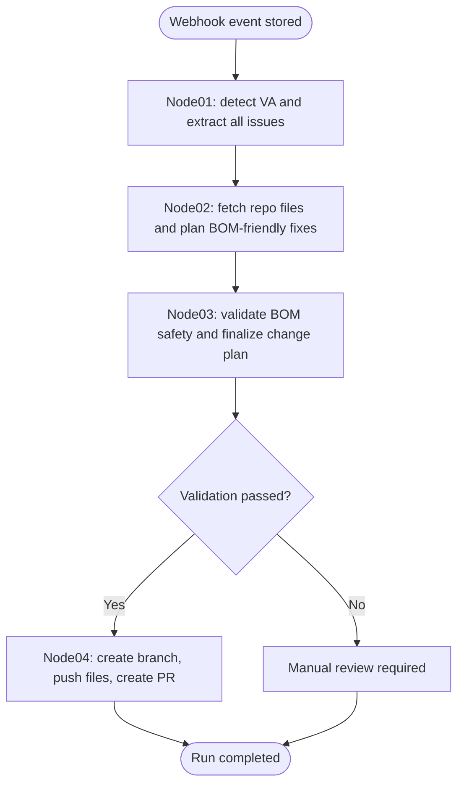
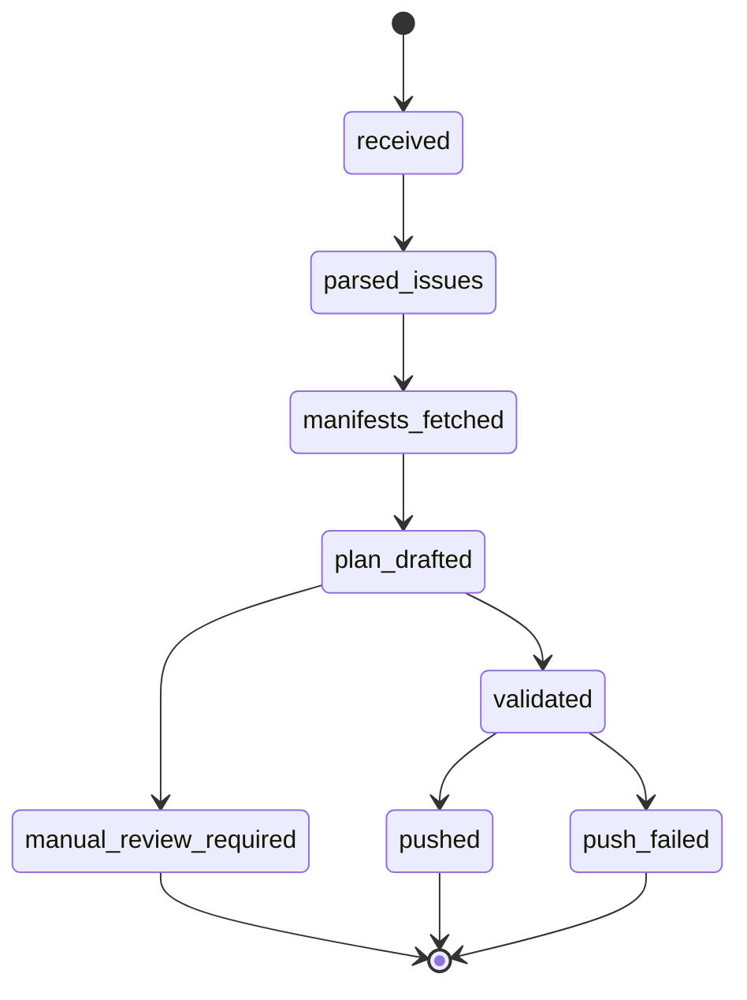

# LangGraph State And Nodes

## Graph flow

## State transition view

## Node I/O contract

```mermaid
flowchart LR
    In[Graph input state]
    N1[Node01]
    N2[Node02]
    N3[Node03]
    N4[Node04]
    Out[Final state]

    In -->|console_text event metadata| N1
    N1 -->|issue_list general_solutions| N2
    N2 -->|repo_files remediation_candidates| N3
    N3 -->|validated_change_plan validation_passed| N4
    N4 -->|branch_name PR URL final_status| Out
```

## Recommended state slices by node

### Node 01 writes

- `va_detected`
- `issue_list`
- `issue_summary`
- `general_solutions`
- `scan_targets`

### Node 02 writes

- `repo_files`
- `manifest_context`
- `remediation_candidates`
- `selected_change_plan_draft`

### Node 03 writes

- `validated_change_plan`
- `validation_passed`
- `validation_notes`
- `manual_review_required`

### Node 04 writes

- `branch_name`
- `changed_files`
- `pull_request_url`
- `final_status`
