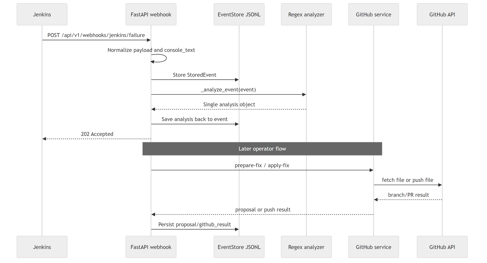
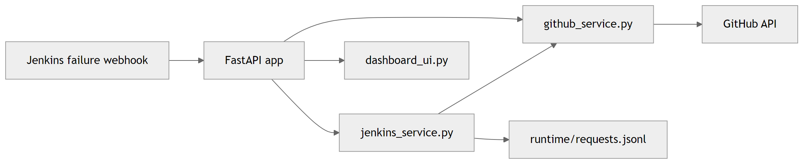
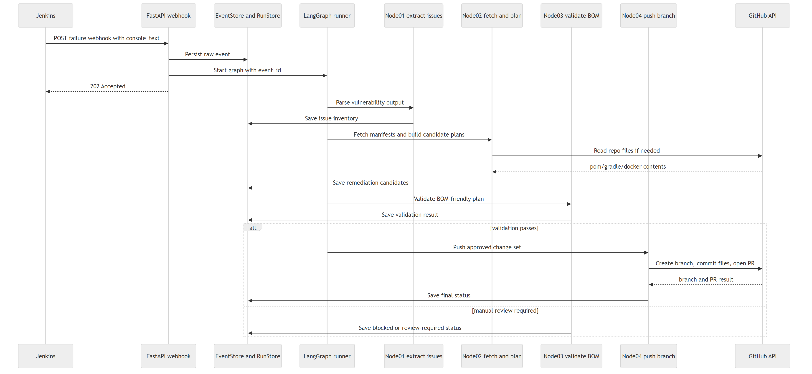
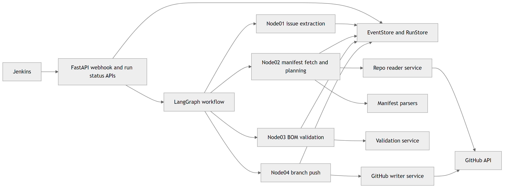
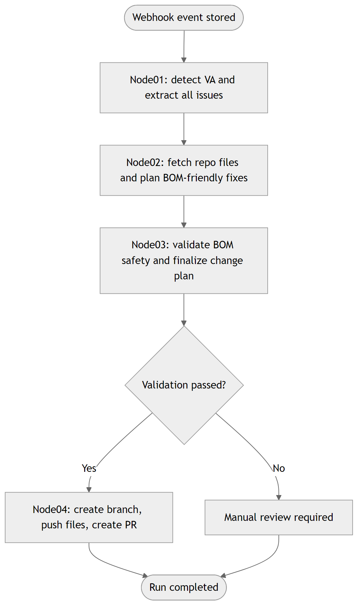
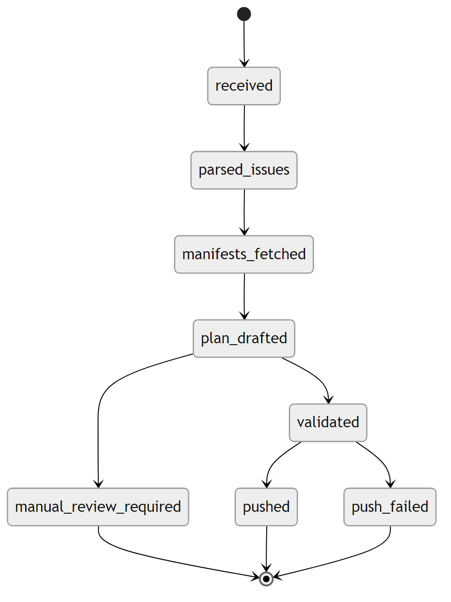
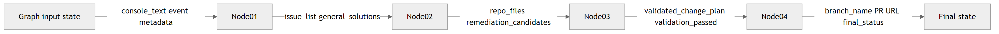

# LangGraph-Based Vulnerability Remediation Architecture

## 1. Purpose

This document defines the target architecture for processing Jenkins failure webhooks through a four-node LangGraph workflow that can:

- extract all vulnerability issues from the Jenkins failure output
- inspect repo manifests and Docker files
- generate BOM-friendly remediation plans
- validate the proposed changes before any branch write
- push approved changes to a new remediation branch

The design is intentionally aligned with the current codebase so implementation can extend the existing FastAPI and GitHub integration instead of replacing them.

## 2. Current Integration Point

The existing code already provides the correct entry boundary:

- FastAPI application bootstrap in `dev_test/py/non_ai_flow/app.py`
- Jenkins webhook capture in `dev_test/py/non_ai_flow/jenkins_service.py`
- GitHub file fetch and branch push helpers in `dev_test/py/non_ai_flow/github_service.py`

What must change is the reasoning layer. The current `_analyze_event()` path is still single-pattern oriented and cannot safely process full Trivy-style vulnerability tables containing many issues, shared packages, and BOM-controlled dependencies.

## 3. Target Outcome

When Jenkins posts a failed build payload:

1. the webhook stores the raw event and console text
2. LangGraph receives the stored event as input
3. Node 01 extracts all vulnerability findings and general remediation directions
4. Node 02 fetches repo manifests and produces BOM-aware candidate fixes
5. Node 03 validates the candidate fix set and blocks unsafe changes
6. Node 04 creates a remediation branch and pushes the approved files

## 4. End-to-End Flow

### 4.1 Current flow vs target flow

The current flow is useful for capture and simple automation, but the target flow introduces structured graph orchestration and a validation gate.

### 4.2 Target operational sequence

The runtime sequence should be:

1. Jenkins posts to `POST /api/v1/webhooks/jenkins/failure`
2. FastAPI stores the raw event, metadata, and console text
3. A graph run is started asynchronously using the stored `event_id`
4. LangGraph executes Node 01 to Node 04 in sequence
5. Node outputs are persisted after each step
6. If validation fails, the run is marked for manual review
7. If validation passes, the approved change plan is pushed to a new branch and a PR or compare URL is returned

## 5. Node Definitions

## Node 01: Vulnerability Extraction And General Solutioning

### Objective

Transform raw Jenkins failure output into a structured vulnerability inventory.

### Input

- `event_id`
- `console_text`
- repo metadata if present in the webhook payload

### Responsibilities

- detect whether the payload contains vulnerability scan output
- parse Trivy-style tables and other structured scan sections
- extract all findings, not just one package/version pair
- group findings where one package is associated with multiple CVEs
- capture general remediation advice for each issue group

### Output

- `va_detected`
- `issue_list`
- `issue_summary`
- `general_solutions`
- `scan_targets`

### Why it matters

This node closes the biggest current gap. The current regex path can collect some CVE ids, but it cannot safely transform a real multi-row Trivy report into a complete remediation-ready issue model.

## Node 02: Repo Fetch And BOM-Friendly Remediation Planning

### Objective

Load the repo control files and determine the correct place to apply a fix.

### Input

- `issue_list`
- `repo`
- `branch`
- optional `local_repo_path`

### Responsibilities

- fetch and inspect `pom.xml`, `build.gradle`, `build.gradle.kts`, `gradle.properties`, `settings.gradle`, `settings.gradle.kts`, and `Dockerfile`
- detect whether a dependency is owned by:
  - parent POM
  - imported BOM
  - `dependencyManagement`
  - Gradle platform
  - property or version catalog
  - direct dependency declaration
- generate candidate remediation plans
- prefer higher-level BOM or parent upgrades over scattered leaf-version overrides

### Output

- `repo_files`
- `manifest_context`
- `remediation_candidates`
- `selected_change_plan_draft`

### Why it matters

A vulnerable library listed in the scan output is not always the correct place to edit. In Maven and Gradle projects, the real control point is often a parent, BOM, or property rather than the dependency line itself.

## Node 03: BOM Safety And Change Validation

### Objective

Reject unsafe plans and finalize only BOM-safe remediation paths.

### Input

- `manifest_context`
- `remediation_candidates`

### Responsibilities

- validate whether the selected candidate respects dependency ownership rules
- block inline version insertion when the dependency is BOM-managed
- prefer one higher-level change when it resolves multiple vulnerabilities safely
- identify incomplete plans where several files must change together
- mark low-confidence or incompatible major-version upgrades for manual review

### Output

- `validated_change_plan`
- `validation_passed`
- `validation_notes`
- `manual_review_required`

### Why it matters

This is the hard safety gate in the design. No branch push should happen before this node explicitly approves the full write set.

## Node 04: Branch Creation And GitHub Push

### Objective

Write the approved change set to GitHub and create a reviewable remediation branch.

### Input

- `validated_change_plan`
- `repo`
- `base_branch`

### Responsibilities

- build a remediation branch name
- write all approved file changes
- create or reuse the target branch
- create the PR or compare link
- persist the final run result

### Output

- `branch_name`
- `changed_files`
- `pull_request_url`
- `final_status`

### Why it matters

The current GitHub helper is useful, but it is still single-file oriented. Node 04 needs multi-file commit support so BOM fixes, property updates, and Docker changes can move together as one safe change set.

## 6. Graph Flow And State

### 6.1 Node flow

### 6.2 State transition model

### 6.3 Node I/O contract

## 7. Recommended Graph State

The graph should persist a state object with at least:

- event metadata
- raw `console_text`
- structured `issue_list`
- manifest and repo context
- remediation candidates
- validated change plan
- final branch and PR result
- status, errors, and manual review flags

Minimum recommended top-level fields:

- `event_id`
- `repo`
- `branch`
- `build_url`
- `console_text`
- `va_detected`
- `issue_list`
- `repo_files`
- `manifest_context`
- `remediation_candidates`
- `validated_change_plan`
- `validation_passed`
- `manual_review_required`
- `branch_name`
- `pull_request_url`
- `final_status`

## 8. Clear Implementation Boundaries

To keep the codebase maintainable, the graph implementation should be split into explicit modules:

- `graph/state.py`
- `graph/builder.py`
- `graph/nodes/node01_extract_issues.py`
- `graph/nodes/node02_fetch_and_plan.py`
- `graph/nodes/node03_validate_bom.py`
- `graph/nodes/node04_push_branch.py`
- `services/repo_reader.py`
- `services/manifest_parser.py`
- `services/remediation_planner.py`
- `services/validation_service.py`
- `services/github_writer.py`

This prevents `jenkins_service.py` from becoming the permanent home for webhook handling, parsing, planning, validation, and GitHub orchestration all at once.

## 9. Reuse Strategy For The Current Codebase

What should be reused:

- the FastAPI ingress route and event capture pattern
- the stored event model concept
- repo and branch metadata already present in webhook payloads
- GitHub fetch logic for analysis files
- branch naming and PR integration patterns

What should be replaced or extended:

- replace `_analyze_event()` with Node 01
- replace `_prepare_fix()` with Node 02 plus Node 03 planning and validation
- replace single-file push behavior with a multi-file writer for Node 04

## 10. Recommended Build Order

### Phase 1

Implement the graph shell and run it from stored events without changing current production behavior.

### Phase 2

Build Node 01 against the real Trivy sample payload and make sure the system no longer marks the payload as unsupported.

### Phase 3

Build Node 02 manifest ownership detection for Maven, Gradle, and Docker inputs.

### Phase 4

Build Node 03 as the mandatory safety gate before any repo write.

### Phase 5

Build Node 04 with multi-file GitHub branch commit support.

### Phase 6

Expose graph run status and node outputs in the UI.

## 11. Final Recommendation

The architecture should keep the current webhook ingress and GitHub integration, but move the core intelligence into a structured LangGraph workflow with explicit node ownership and an enforced validation gate.

That gives the project the best balance of:

- low disruption to the existing codebase
- higher analysis quality for real scan outputs
- safer BOM-aware remediation behavior
- a clean path to automated branch creation with reviewable changes
